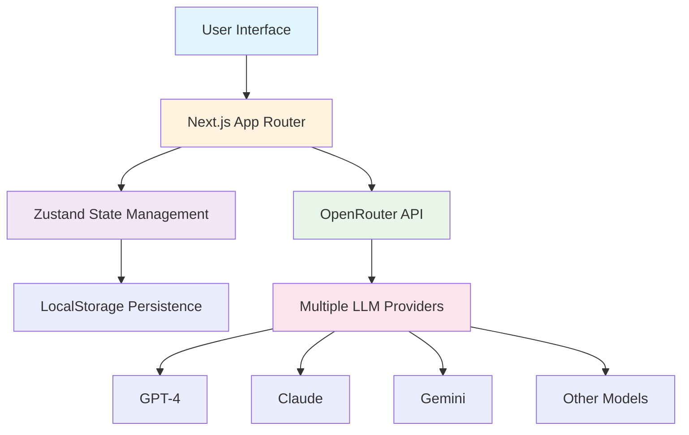
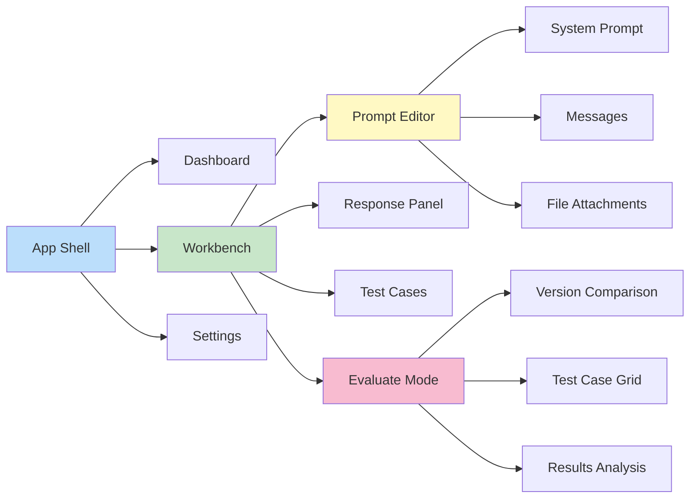
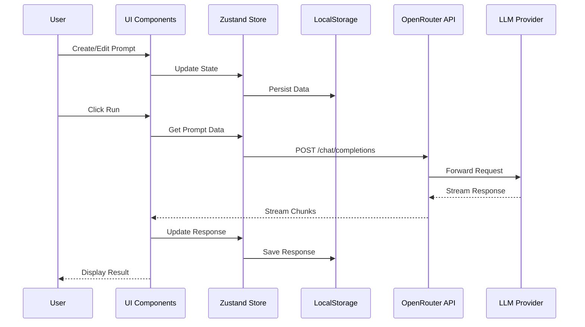
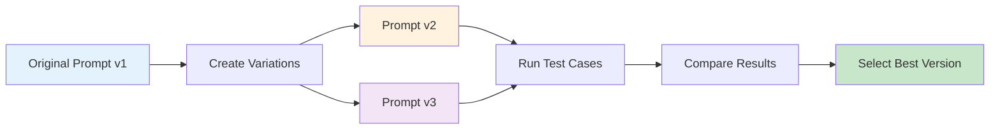
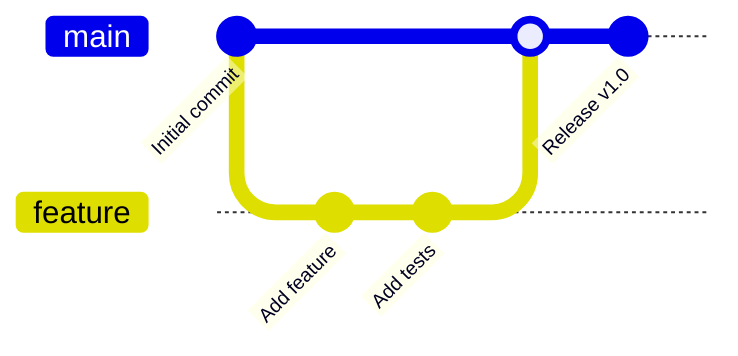

# Prompt Console

<div align="center">
  

  **A Model-Agnostic Prompt Engineering Platform**

  [](https://nextjs.org/)
  [](https://www.typescriptlang.org/)
  [](./LICENSE)
</div>

---

## 🎯 Intent of the Project

I wanted to build this project with an intention of learning, but at the same time, **Claude Console is a very good prompt optimizer platform**. There is nothing that is model- or LLM-agnostic, so this is why this is an exact replica of the Anthropic Claude Console, but this is **model-agnostic**.

You can bring in your own API from **OpenRouter** and switch to any model provider by OpenRouter, which is a text model or a multi-modal model, and utilize it to **optimize your prompts**. Test it with test cases. This was the intention behind building this project.

**It's completely free and open-sourced.**

---

## ✨ Features

### 🚀 Core Capabilities

- **Model Agnostic** - Works with any model supported by OpenRouter (GPT-4, Claude, Gemini, Llama, and more)
- **Prompt Engineering** - Craft, test, and refine prompts with an intuitive interface
- **Test Cases** - Create and manage test cases with variable substitution
- **Evaluation Mode** - Compare multiple prompt versions side-by-side
- **File Uploads** - Attach images, PDFs, and documents to your prompts
- **Version History** - Track changes and iterate on your prompts
- **Real-time Streaming** - See responses as they're generated
- **Code Export** - Export prompts to Python, TypeScript, or cURL

### 🎨 User Experience

- **Resizable Panels** - Customize your workspace layout
- **Dark/Light Mode** - Comfortable viewing in any environment
- **Keyboard Shortcuts** - Speed up your workflow (⌘+↵ to run)
- **Auto-save** - Never lose your work
- **Responsive Design** - Works seamlessly on desktop and tablet

---

## 🏗️ Architecture

### System Overview



### Component Architecture



### Data Flow



---

## 🚦 Getting Started

### Prerequisites

- Node.js 18+
- npm or yarn
- OpenRouter API Key ([Get one here](https://openrouter.ai/))

### Installation

1. **Clone the repository**
   ```bash
   git clone https://github.com/yourusername/prompt-console.git
   cd prompt-console
   ```

2. **Install dependencies**
   ```bash
   npm install
   # or
   yarn install
   ```

3. **Run the development server**
   ```bash
   npm run dev
   # or
   yarn dev
   ```

4. **Open your browser**
   Navigate to [http://localhost:3000](http://localhost:3000)

5. **Add your OpenRouter API Key**
   - Go to Settings → API Keys
   - Click "Add API Key"
   - Paste your OpenRouter API key
   - You're ready to start!

---

## 📖 Usage Guide

### Creating Your First Prompt

1. **Navigate to Dashboard** and click "Create a prompt"
2. **Write your system prompt** (optional) - Define the AI's role and behavior
3. **Add user messages** - Craft your prompt with variables like `{{variable_name}}`
4. **Select a model** - Choose from hundreds of models via OpenRouter
5. **Click Run** - See the response in real-time

### Using Variables

Variables allow you to create reusable prompts:

```
Write a {{tone}} email about {{topic}} for {{audience}}
```

When you run the prompt, you'll be prompted to fill in values for `tone`, `topic`, and `audience`.

### Creating Test Cases

1. **Click the test case icon** in the workbench toolbar
2. **Add test case** with specific variable values
3. **Run all test cases** to see how your prompt performs across scenarios
4. **Compare results** to find the best prompt variation

### Evaluating Prompt Versions



1. Switch to **Evaluate** tab
2. Click **Add Comparison** to create a new prompt version
3. Modify the prompt and save as a new version
4. **Run All** to execute all test cases across all versions
5. **Compare results** side-by-side to find the best performing version

### Exporting Code

Need to use your prompt in production? Click **Get Code** to export:

- **Python** - Ready-to-use requests code
- **TypeScript** - Fetch API implementation
- **cURL** - Command-line ready

---

## 🗂️ Project Structure

```
prompt-console/
├── app/                      # Next.js 16 App Router
│   ├── (console)/           # Console layout group
│   │   ├── dashboard/       # Dashboard page
│   │   ├── workbench/       # Workbench pages
│   │   ├── api-keys/        # API key management
│   │   └── settings/        # User settings
│   └── layout.tsx           # Root layout
├── components/              # React components
│   ├── dashboard/          # Dashboard components
│   ├── workbench/          # Workbench components
│   ├── layout/             # Layout components
│   └── ui/                 # shadcn/ui components
├── stores/                 # Zustand state stores
│   ├── prompt-store.ts     # Prompt management
│   ├── workbench-store.ts  # Workbench state
│   ├── settings-store.ts   # User settings
│   └── evaluate-store.ts   # Evaluation state
├── hooks/                  # Custom React hooks
│   ├── use-openrouter.ts   # OpenRouter API integration
│   └── use-evaluate.ts     # Evaluation logic
├── lib/                    # Utility functions
│   ├── constants.ts        # App constants
│   └── storage-keys.ts     # LocalStorage keys
├── types/                  # TypeScript type definitions
│   └── index.ts            # Central type exports
└── public/                 # Static assets
    └── prompt-console.jpg  # Logo
```

---

## 🛠️ Technology Stack

### Frontend
- **Framework**: Next.js 16 (App Router, React 19, Turbopack)
- **Language**: TypeScript 5
- **Styling**: Tailwind CSS 4
- **UI Components**: shadcn/ui
- **Icons**: Lucide React

### State Management
- **Global State**: Zustand with persistence
- **Local Storage**: Browser localStorage for data persistence

### API Integration
- **LLM Gateway**: OpenRouter API
- **HTTP Client**: Native fetch with streaming support

### Development Tools
- **Package Manager**: npm
- **Linting**: ESLint
- **Type Checking**: TypeScript compiler

---

## 🎨 Design System

The project uses a warm beige theme with carefully crafted color palettes:

### Color Scheme
```css
--background: 39 20% 96%;      /* Warm beige background */
--foreground: 39 20% 10%;      /* Dark text */
--card: 39 20% 98%;            /* Card background */
--primary: 39 30% 40%;         /* Primary accent */
--muted: 39 15% 90%;           /* Muted elements */
--border: 39 20% 85%;          /* Borders */
```

### Typography
- **Headings**: Figtree (Google Font)
- **Body**: Geist Sans
- **Code**: Geist Mono

---

## 🔐 Privacy & Security

- **Local-First**: All data stored in your browser's localStorage
- **No Analytics**: We don't track your usage
- **API Keys**: Stored locally, never transmitted to our servers
- **Open Source**: Audit the code yourself

---

## 🤝 Contributing

We welcome contributions! Here's how you can help:

1. **Fork the repository**
2. **Create a feature branch** (`git checkout -b feature/amazing-feature`)
3. **Commit your changes** (`git commit -m 'feat: add amazing feature'`)
4. **Push to the branch** (`git push origin feature/amazing-feature`)
5. **Open a Pull Request**

### Development Workflow



---

## 📝 License

This project is licensed under the MIT License - see the [LICENSE](LICENSE) file for details.

---

## 🙏 Acknowledgments

- **Anthropic** - Inspiration from Claude Console's excellent UX
- **OpenRouter** - For providing model-agnostic API access
- **shadcn/ui** - Beautiful, accessible component library
- **Next.js Team** - Amazing framework and developer experience

---

## 📧 Contact & Support

- **Issues**: [GitHub Issues](https://github.com/yourusername/prompt-console/issues)
- **Discussions**: [GitHub Discussions](https://github.com/yourusername/prompt-console/discussions)

---

<div align="center">

  **Built with ❤️ for the AI community**

  [⭐ Star this repo](https://github.com/yourusername/prompt-console) if you find it useful!

</div>
